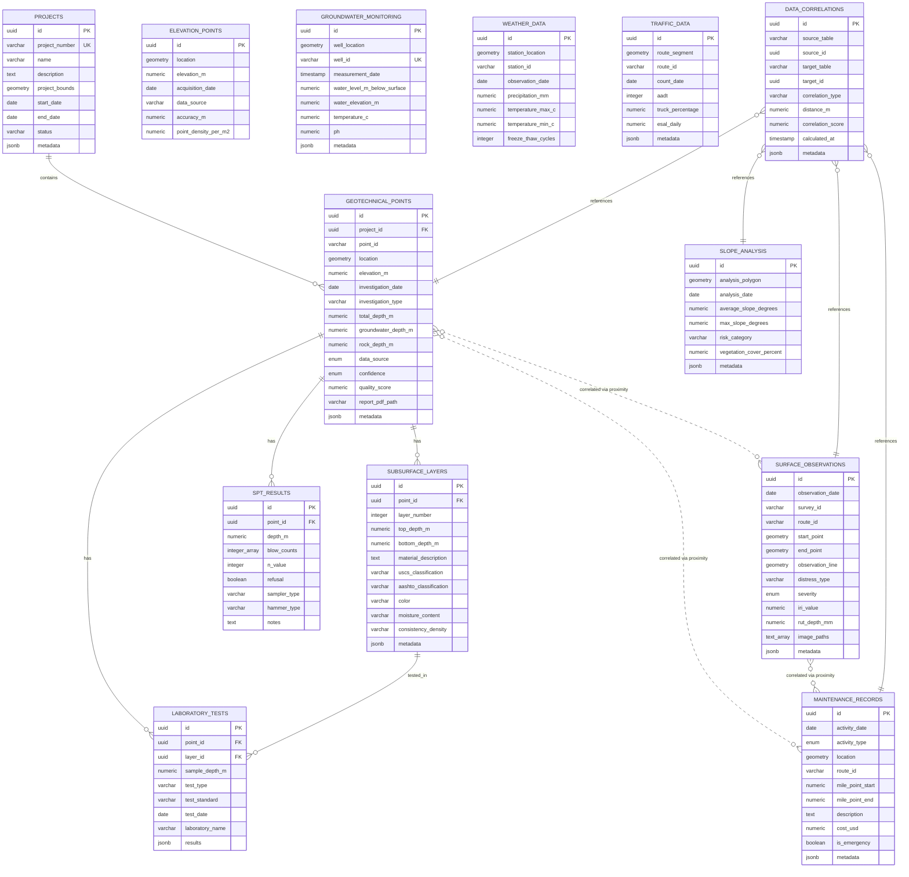

# GMS Foundation Database Schema

## Entity Relationship Diagram



## Key Design Principles

### 1. **Spatial-First Design**
- Every table with location data uses PostGIS geometry types
- Spatial indexes enable fast proximity queries
- All coordinates stored in WGS84 (EPSG:4326)

### 2. **Flexible Data Storage**
- JSONB columns for metadata and variable test results
- Allows schema evolution without migrations
- Supports diverse data sources and formats

### 3. **Data Quality Tracking**
- Confidence levels and quality scores
- Data source tracking for provenance
- Temporal tracking with timestamps

### 4. **Integration Through Correlation**
- `DATA_CORRELATIONS` table links any data types
- Correlation scores indicate relationship strength
- Distance-based and analytical correlations

### 5. **Performance Optimization**
- Materialized views for complex calculations
- Spatial and standard indexes on key columns
- Partitioning ready for large datasets

## Common Query Patterns

### Find all data near a location
```sql
-- Using spatial functions to find related data
SELECT * FROM geotechnical_points
WHERE ST_DWithin(location, point::geography, radius_meters);
```

### Correlate surface and subsurface
```sql
-- Join through correlations table
SELECT gp.*, so.distress_type, dc.correlation_score
FROM geotechnical_points gp
JOIN data_correlations dc ON dc.target_id = gp.id
JOIN surface_observations so ON dc.source_id = so.id
WHERE dc.correlation_type = 'proximity';
```

### Generate subsurface profiles
```sql
-- Use built-in function for cross-sections
SELECT * FROM generate_subsurface_profile(
    ST_MakeLine(start_point, end_point),
    buffer_distance
);
```